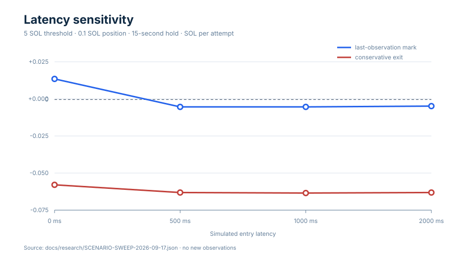
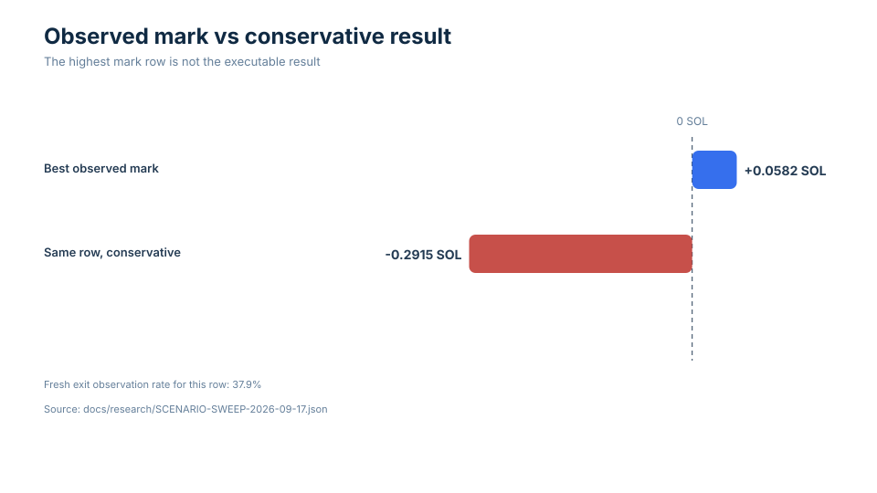
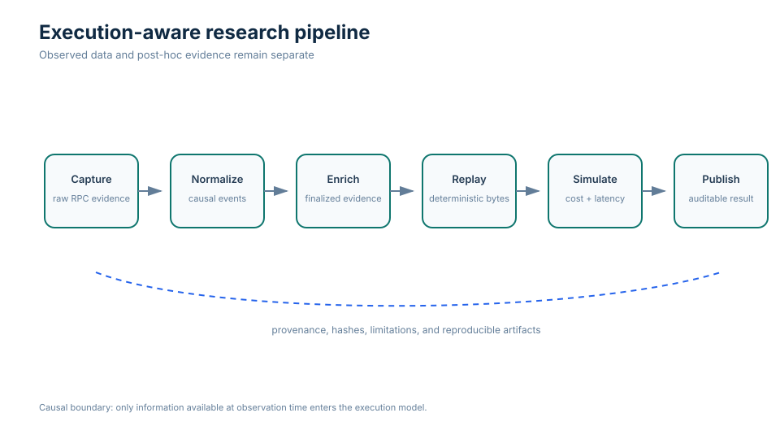
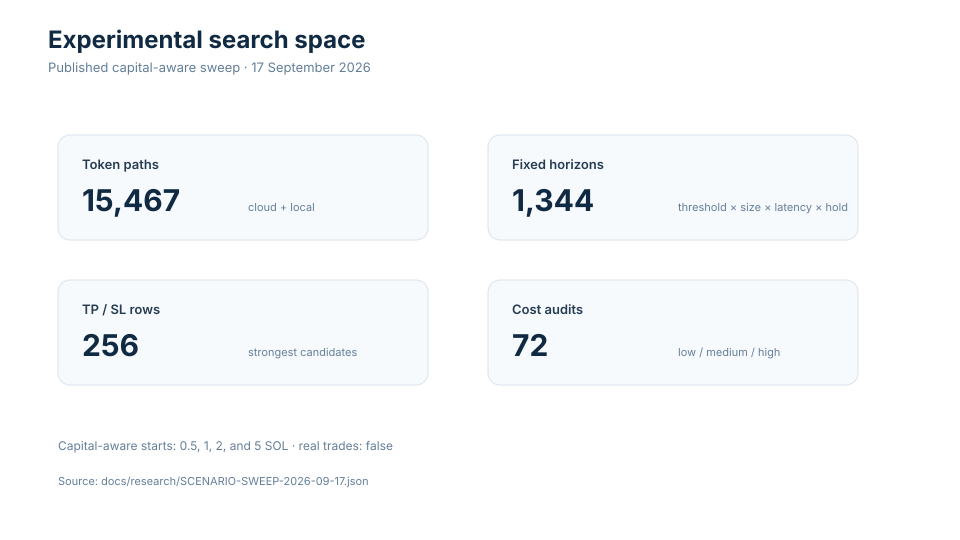

# Botwiner

**Reproducible execution-aware research into ultra-short-horizon Pump.fun market strategies.**

[](https://github.com/obadadallo95/botwiner/actions/workflows/ci.yml)

Botwiner asks a narrow question: when a newly launched Pump.fun token crosses a
defined bonding-curve threshold, can a small, capital-aware paper portfolio
enter and exit profitably after latency, curve price impact, fees, stale
observations, and migration uncertainty are included?

> **NO PRODUCTION-READY EDGE FOUND**
>
> The published sweep found positive-looking outcomes only under idealized
> last-observation marks. The result became negative when exit freshness,
> latency, costs, and unresolved migration were treated as execution risks.
>
> This repository contains research and paper simulation only. It does not
> contain a trading wallet, transaction sender, or recommendation to trade.

The final experiment evaluated **15,467 token paths**, **1,344 fixed-horizon
combinations**, **256 take-profit/stop-loss combinations**, and **72 cost
audits**, with capital-aware ledgers starting at 0.5, 1, 2, and 5 SOL.

For the strongest mark row (5 SOL threshold, 0.5 SOL position, zero latency,
15-second hold), mark EV was **+0.0582 SOL per attempt**, while only **37.9%** of
exits had a fresh observation and the conservative treatment was
**−0.2915 SOL**. At a 5 SOL threshold, 0.1 SOL position, and 15-second hold,
mark EV moved from **+0.0139 SOL at 0 ms** to **−0.0050 SOL at 500 ms**.





## Research result

The negative result is a boundary-specific finding, not a claim that every
crypto strategy is impossible. The tested launch-and-exit rules did not retain
positive expected value under conservative, execution-aware assumptions. The
full report preserves the dataset split, causal observation boundary, cost
model, capital constraints, right-censoring treatment, and threats to validity:

- [Negative-result paper](docs/research/NEGATIVE-RESULT.md)
- [Machine-readable scenario sweep](docs/research/SCENARIO-SWEEP-2026-09-17.json)
- [Research artifact index](docs/research/README.md)
- [Experiment provenance](docs/research/PROVENANCE.md)

## Why this matters

Short-horizon backtests can confuse a recorded price mark with an executable
exit. Botwiner keeps those concepts separate. It records raw notifications,
normalizes events without looking ahead, enriches finalized evidence after the
causal boundary, replays the same bytes deterministically, and evaluates
latency, curve impact, fees, stale quotes, and capital reservation explicitly.
That makes a negative result useful: it identifies which assumptions created
the apparent edge and which observations are still missing.

## Architecture



The main path is:

1. **Capture** Solana `logsSubscribe` or optional Yellowstone gRPC evidence.
2. **Normalize** Pump bonding-curve launches and trades in collector order.
3. **Enrich** finalized transaction evidence in a separate post-hoc view.
4. **Replay** raw records into byte-identical normalized events.
5. **Simulate** fixed horizons, TP/SL rules, latency, costs, and capital-aware
   portfolios without live order submission.
6. **Publish** sanitized summaries, hashes, limitations, and audit records.

Standard WebSocket collection remains the default runtime feed. The
`@triton-one/yellowstone-grpc` dependency supports the optional comparison
path; it is not silently used by the default collector.



## Reproduce in five minutes

The committed fixture is intentionally tiny and synthetic. It demonstrates
parsing, deterministic replay, expected SHA-256 verification, and one paper
simulation without waiting for live market traffic or downloading raw market
data:

```bash
pnpm install --frozen-lockfile
pnpm research:demo
```

Expected output includes three `PASS` lines and the fixture digest
`eb30e6e5558664380bc9dafeec55f54c3a59b7218f8c45e93b2cad96c51e3e94`.

Regenerate the four figures from the published JSON only:

```bash
pnpm research:figures
```

Run the full validation suite:

```bash
pnpm check
```

Raw captures are intentionally not committed. To collect a new local session,
use the public endpoint and keep the resulting directory outside Git:

```bash
pnpm collector:start --duration-seconds 30 --output data/sessions/sample
pnpm replay data/sessions/sample
```

See the [artifact index](docs/research/README.md) for phase-specific commands
and the provenance requirements before sharing any capture.

## Self-hosted dashboard

The dashboard has no bundled Firebase project or hosted URL. Copy `.env.example`
to `.env`, fill in a Firebase project and API deployment that you control, and
start it locally:

```bash
cp .env.example .env
pnpm --dir apps/dashboard dev
```

Leave `VITE_API_BASE_URL` empty when using the local Vite proxy. Set it to your
own API URL when the dashboard is served separately. The API requires your own
`GCP_PROJECT_ID`, `GCS_BUCKET`, `OWNER_EMAIL` or `OWNER_UID`, and allowed
origins before cloud session routes are enabled. See the self-hosting section
in `.env.example` and [SECURITY.md](SECURITY.md).

## Repository structure

| Path | Purpose |
| --- | --- |
| `apps/collector` | Live WebSocket / Yellowstone capture CLI |
| `apps/replay` | Deterministic raw-to-event replay |
| `apps/phase2` | Finalized enrichment, rebuild, and quality reports |
| `apps/comparator` | Same-host feed comparison orchestration |
| `apps/simulator` | Causal strategy and pivot research CLIs |
| `apps/dashboard` | Read-only research dashboard |
| `packages/market-data` | Raw, normalized, and venue-neutral schemas |
| `packages/pumpfun` | Official-IDL-derived parsing and quoting helpers |
| `packages/research` | Evidence, portfolios, paper trading, and analytics |
| `packages/storage` | Append-only datasets, manifests, and hashing |
| `docs/research` | Published result, provenance, and reproduction index |
| `examples/sample-session` | Sanitized deterministic demo fixture |
| `infra` | Optional deployment guidance; root templates remain compatible |

## Methodology and limitations

- Collector order and available-at-time cutoffs define the causal input. Later
  finalized metadata is never fed back into the causal simulator.
- Pump curve quotes include position-size price impact and the documented cost
  scenarios. Unknown landing probability, bundle competition, and alternate
  venue exit availability remain explicit unknowns.
- Missing fresh exit state within the five-second bound, or unresolved
  migration, is treated as a full loss in the conservative bound. This is a
  deliberately cautious bound, not a claim about every real exit.
- `processed` notifications can roll back, public RPC has no completeness or
  provider-ingress latency SLA, and standard logs do not reveal bundle
  membership or all required tips.
- The local slice is smaller than the cloud slice and cannot represent every
  market regime. The result is a research conclusion for the captured data
  boundary, not financial advice.

Historical phase documents retain the engineering decisions and open questions
that led to the completed experiment. They are linked from the [research
artifact index](docs/research/README.md) so the landing page stays focused on
the published result.

## Contributing

Read [CONTRIBUTING.md](CONTRIBUTING.md) before opening a pull request. Research
changes should declare hypotheses before evaluation where practical, preserve
causal versus post-hoc boundaries, state execution assumptions, and keep
profitability claims reproducible. No private keys, secrets, live trading
implementation, or unreviewed parameter tuning belongs in a research PR.

## Citation

```bibtex
@software{dallo_botwiner,
  author = {Obada Dallo},
  title = {Botwiner: Reproducible execution-aware Pump.fun market research},
  url = {https://github.com/obadadallo95/botwiner},
  license = {MIT}
}
```

See [CITATION.cff](CITATION.cff) for machine-readable metadata. A future
archival release may be deposited with Zenodo for a DOI; no DOI is claimed by
this repository today.

## License

Code and documentation are released under the [MIT License](LICENSE). Raw
market captures remain subject to provider terms and are not redistributed by
default.
